<p align="center">
  
</p>

<h1 align="center">Terrarium</h1>

<p align="center">
  A little world that keeps living whether you're watching or not.
</p>

---

Terrarium is a generative simulation: a population of citizens forages,
gathers materials, builds homes, and forms named settlements on a
procedurally-generated terrain grid — entirely from a small set of local
rules, no scripted outcomes. The simulation runs on a persistent server
process (ticks continuously, survives restarts via SQLite snapshots) and is
watched, not driven, by a browser client that renders whatever the server
broadcasts over WebSocket.

## What's actually going on

Each tick, every citizen:

1. **Regrows** the terrain it's standing near (terrain resource climbs back
   toward capacity every tick, faster near a completed home — agriculture).
2. **Metabolizes** — spends resource just to be alive; hits zero, dies.
3. **Decides**, occasionally (not every tick — that's what stops the herky-jerky
   MVP-era "buzzing"), where to go next: a remembered good spot, a fresh
   scan of nearby cells, or a material node if it has resource to spare.
4. **Moves** a little closer to wherever it decided, every tick, so motion
   reads as walking, not teleporting.
5. **Gathers** wood or stone if it went looking for it, hauls it home,
   and **deposits** it — enough deposits and a home under construction
   finishes and starts boosting the land around it.
6. **Reproduces** once it's got resource to spare, splitting itself into a
   parent and a child.

Terrain **wears** into paths where citizens walk repeatedly, weather rolls
through in patches and boosts growth while it lasts, and once a cluster of
citizens sustains itself long enough it gets **registered as a named
settlement** (hut → village → city, sized by population and material
investment) that shows up as a labeled icon when you zoom out.

None of that is scripted per-outcome — *where* a village forms and *whether*
a road wears in are emergent; the *rules* that produce them are fixed and
live in one place each (see "Where things live" below).

## Architecture

```
World server (Node, tsx)  ──tick()──▶  SQLite (snapshots + event log)
        │
        │  WebSocket broadcast, ~10Hz, versioned wire format
        ▼
Browser client (Vite + Pixi.js)  — renders whatever it's told, ticks nothing
```

- **`src/sim/`** — the simulation itself. Pure TypeScript, zero DOM/Pixi
  imports, fully deterministic given a seed. `tick(world)` advances one
  step; `createWorld()` builds a fresh one. This is the only place gameplay
  rules live.
- **`src/server/`** — a standalone process that owns the live `World`, ticks
  it on its own interval independent of any client, persists it to SQLite
  (full snapshots on an interval + an append-only birth/death/settlement
  event log), and serves it to clients over WebSocket. Survives a restart:
  on boot it loads the latest snapshot (through a versioned migration step)
  instead of assuming the stored shape matches the current code.
- **`src/shared/`** — the wire format (`WireSnapshotV1`) both the server and
  client import, so they can't silently drift apart.
- **`src/net/`** — the client's WebSocket connection (`connectToServer`),
  with reconnect-on-drop.
- **`src/render/`** — Pixi.js drawing. Reads whatever data it's handed and
  draws it; never mutates anything, never simulates anything.
- **`src/ui/`** — DOM/CSS overlays (the stat panel, settlement name labels)
  laid over the canvas. Same read-only rule as `render/`.

The client used to run its own copy of the simulation in the browser tab. It
doesn't anymore — closing every browser tab doesn't pause the world, and the
`src/net/` → `src/render/` → `src/ui/` path is the entire client: take the
latest snapshot, hand its fields to the right layer, done.

## Getting it running

```bash
npm install

# terminal 1 — the simulation, ticking on its own
npm run server

# terminal 2 — a browser client watching it
npm run dev
```

Open the URL Vite prints. You'll see the world as it currently is — if the
server's been running a while, that might already include a handful of
named settlements.

Click a citizen to select it: the camera follows it and a small panel shows
its live stats. Click empty space (or the panel's "Stop following") to let
go. Zoom out past a threshold and the view switches from individual
citizens to a labeled settlement map, with roads drawn between places
connected by a sufficiently worn route.

Other useful commands:

```bash
npm run sim:headless   # run the sim standalone, no server/client, just console output
npm test                # the sim + server test suite (vitest)
npm run server:dev      # server with auto-restart on file change
```

The server writes to `data/terrarium.db` (SQLite, WAL mode) by default —
delete it to start over, or see `deploy/README.md` for the backup command
if you don't want to.

## Where things live, if you're changing something

| You want to change... | Look at |
|---|---|
| A rule constant (metabolism rate, vision radius, population cap, etc.) | `src/sim/constants.ts` — every tunable is named and commented, one place |
| How a citizen decides/moves/forages | `src/sim/systems/visionMovementHarvest.ts` |
| Gathering, hauling, homes | `src/sim/systems/materials.ts`, `src/sim/homes.ts` |
| Terrain regrowth, agriculture, path wear, weather | `src/sim/terrain.ts`, `src/sim/weather.ts` |
| Settlement tiers / naming / founding & dissolving | `src/sim/systems/settlements.ts` |
| The tick order itself | `src/sim/tick.ts` — every system's call site, and *why* it's ordered that way, is documented right there |
| What the server persists, and the snapshot shape | `src/server/persistence/` |
| Adding a new field to the sim later | `src/server/migrations/` — **write a migration**, don't assume old snapshots already have it. `v1.ts` has a worked example of the pattern |
| What gets sent to the browser, and how often | `src/shared/wireFormat.ts`, `src/server/ws/server.ts` |
| How something is drawn | `src/render/<thing>Layer.ts` — one file per visual layer (citizens, materials, homes, settlements, terrain) |

If you're touching `src/sim/`, run `npm test` — it's the fastest way to
know whether a rule change broke something else, and there's a
`test/server/serialization.test.ts` round-trip test that will catch it if a
sim change breaks snapshot compatibility.

## A rule for later, not just now

Any time a future change adds a field or component to the simulation,
**write a migration** (`src/server/migrations/`) that backfills a sensible
default for snapshots saved before that change existed. That's the
difference between "the world survives updates" being actually true versus
just something we say. The migration framework is built for this already —
see the worked example in `src/server/migrations/v1.ts`.

## Deploying it somewhere real

Not part of this repo's day-to-day, but `deploy/README.md` has the exact
steps — including a genuinely easy-to-miss Oracle Cloud gotcha around
`iptables` blocking inbound traffic independently of the Console's own
firewall rules — plus the systemd unit and the one correct way to back up a
live SQLite file.
